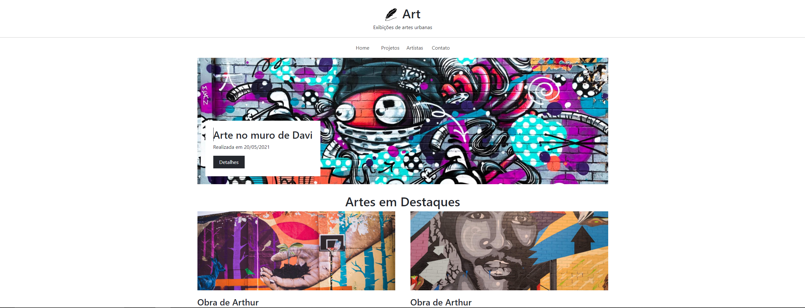

# Project-Art

<h1 align="center">
    
</h1>

## 💻 Sobre o projeto

Esse é um dos meus primeiros projetos usando bootstrap.

<h3 align="center">
    <a href="https://a-art-project.netlify.app/">Acessar a demonstração</a>
<h3 >

### Sobre o Projeto

<h1>
    
</h1>

## 🛠 Tecnologias

As seguintes ferramentas foram usadas na construção do projeto:
- [x] Criação HTML e Bootstrap
- [x] Criação CSS
- [x] Criação JavaScript

## 📝 Licença

Este projeto esta sobe a licença MIT.

Feito com ❤️ por Weslei França 👋🏽 [Entre em contato!](https://www.linkedin.com/in/wesleifranca)
